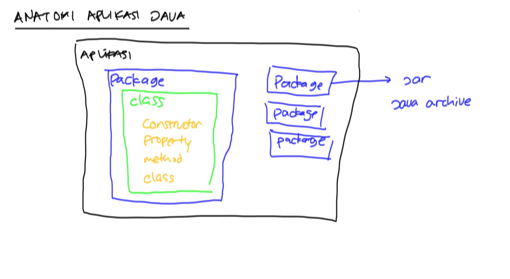

## Why Java? ##

* Penggunaan luas : web, mobile, desktop, background processing, dsb
* Library
* Ekosistem 
* Mature
* Backward compatibility

## Kelengkapan coding Java ##

* Java SDK
* IDE 
* Build Tools (Maven atau Gradle)

## Struktur Aplikasi Java ##

## Perintah Java SDK ##

* Compile source code

    javac NamaFile.java

* Menjalankan aplikasi (harus ada method `main`)

    java NamaClass

* Compile dan taruh hasilnya di folder `hasil`

        javac -d hasil c:/training/java/hari1/*.java

* Set classpath di command line option

        java -cp hasil NamaClass

* Set classpath di environment cmd (*Nix)

        export CLASSPATH=/Users/endymuhardin/hasil

* Set classpath di environment cmd (Windows)

        set CLASSPATH=c:/Users/endy/belajar

* Set classpath ke folder dan file jar (*Nix)

        export CLASSPATH=/Users/endymuhardin/belajar/hasil:/Users/endymuhardin/training.jar

* Set classpath ke folder dan file jar (Windows)

        set CLASSPATH=c:/Users/endy/belajar;c:/Users/endy/training.jar
