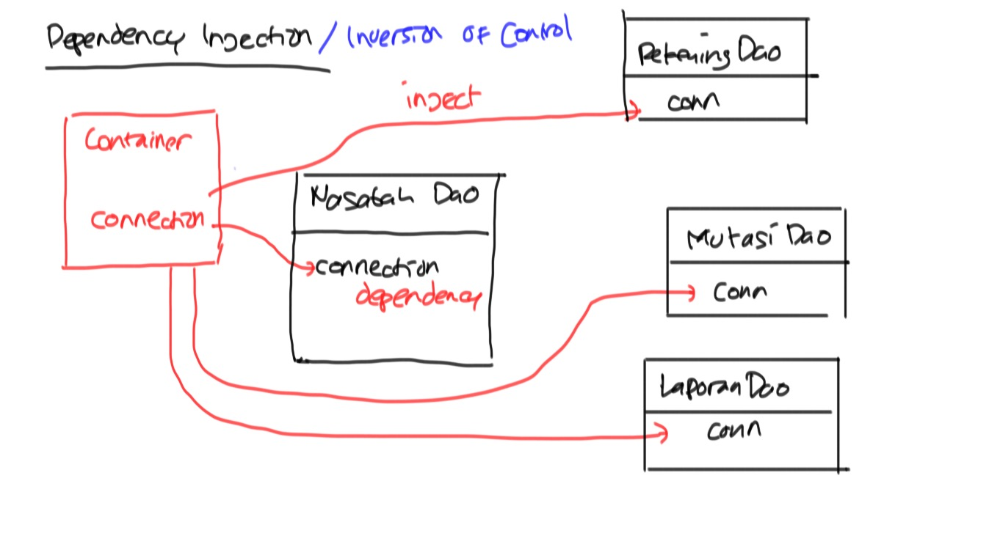
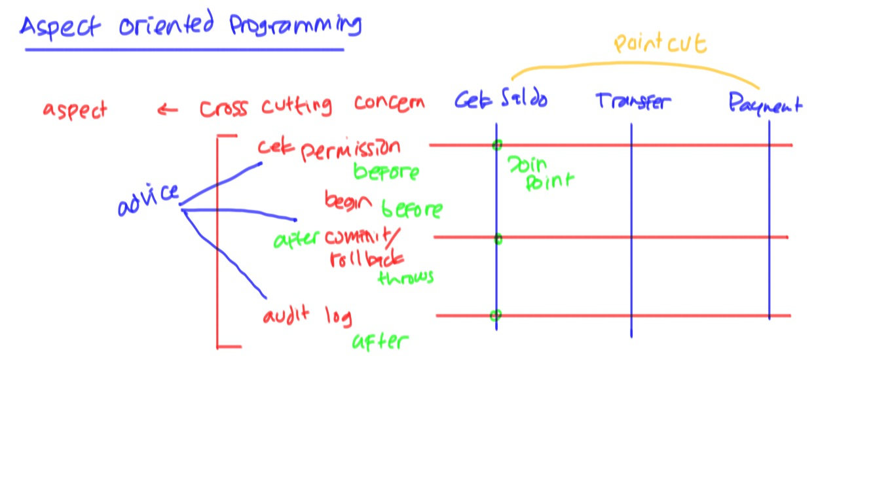
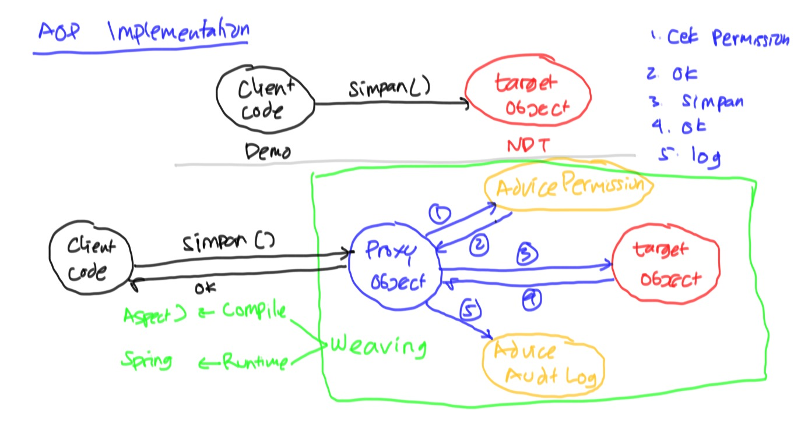
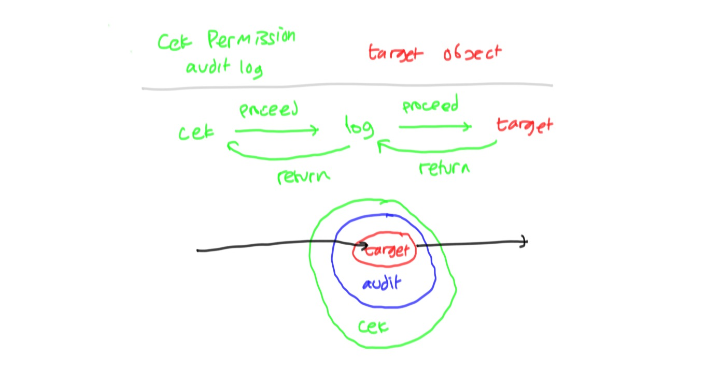
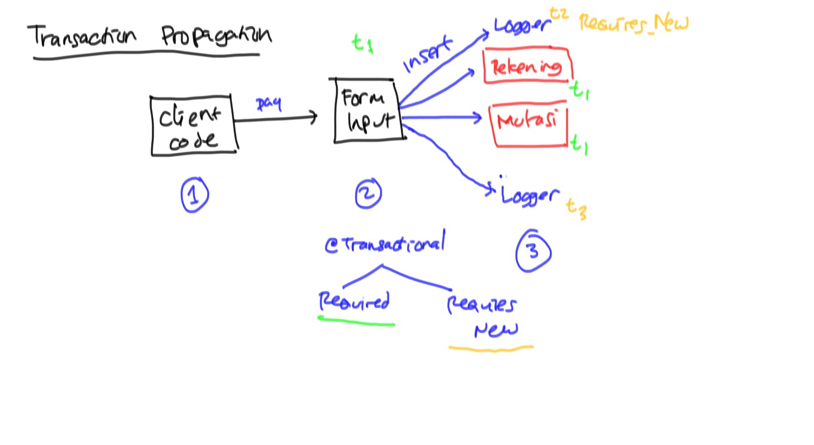

# Intro Spring Framework

* [Spring Framework Reference Manual](https://docs.spring.io/spring/docs/current/spring-framework-reference/htmlsingle/)

## Setup ##

Tambahkan dependensi berikut di `pom.xml`

```xml
    <dependency>
        <groupId>org.springframework</groupId>
        <artifactId>spring-context</artifactId>
        <version>4.3.10.RELEASE</version>
    </dependency>
```

## Inversion of Control ##



### Tanpa IoC ###

```java
public class NasabahDaoTanpaIoC {
	private KoneksiDatabase koneksiDatabase;

	public NasabahDaoTanpaIoC() {
		koneksiDatabase = new KoneksiDatabase();
		koneksiDatabase.setUrl("jdbc:postgresql://localhost/belajar");
		koneksiDatabase.setUsername("demo");
		koneksiDatabase.setPassword("cobacoba");
	}

	private void connect() {
		koneksiDatabase.connect();
	}
}
```

### IoC tanpa Spring ###

* `NasabahDao` menggunakan constructor injection

```java
public class NasabahDaoIoc {
	// tidak ada inisialisasi, karena sudah dihandle orang lain
	private KoneksiDatabase koneksiDatabase;

	public NasabahDaoIoc(KoneksiDatabase koneksiDatabase) {
		this.koneksiDatabase = koneksiDatabase;
	}

	private void connect() {
		koneksiDatabase.connect();
	}
}
```

* Client Code

```java
public class DemoIoc {

	public static void main(String[] args) {
		KoneksiDatabase koneksiDatabase = new KoneksiDatabase();
		koneksiDatabase.setUrl("jdbc:postgresql://localhost/belajar");
		koneksiDatabase.setUsername("demo");
		koneksiDatabase.setPassword("cobacoba");

		NasabahDaoIoc nd = new NasabahDaoIoc(koneksiDatabase);

		nd.simpan();
	}

}
```


### IoC dengan Spring ###


* Client Code

```java
public class DemoIocSpring {

	public static void main(String[] args) {
		ApplicationContext springContainer
			= new ClassPathXmlApplicationContext("belajar-ioc.xml");

		NasabahDaoIoc nasabahDao = (NasabahDaoIoc) springContainer.getBean("nd");
		nasabahDao.simpan();
	}

}
```

* Konfigurasi Dependency Injection

```xml
<?xml version="1.0" encoding="UTF-8"?>
<beans xmlns="http://www.springframework.org/schema/beans"
    xmlns:xsi="http://www.w3.org/2001/XMLSchema-instance"
    xsi:schemaLocation="http://www.springframework.org/schema/beans
        http://www.springframework.org/schema/beans/spring-beans.xsd">


	<!--
		KoneksiDatabase koneksiDatabase = new KoneksiDatabase();
		koneksiDatabase.setUrl("jdbc:postgresql://localhost/belajar");
		koneksiDatabase.setUsername("demo");
		koneksiDatabase.setPassword("cobacoba");
	-->
	<bean id="koneksiDatabase" class="belajar.spring.ioc.KoneksiDatabase">
		<property name="url" value="jdbc:postgresql://localhost/belajarspring"/>
		<property name="username" value="springdemo"/>
		<property name="password" value="cobaspring"/>
	</bean>

	<!--
		NasabahDaoIoc nd = new NasabahDaoIoc(koneksiDatabase);
	-->
	<bean id="nd" class="belajar.spring.ioc.NasabahDaoIoc">
		<constructor-arg ref="koneksiDatabase" />
	</bean>

</beans>
```

## Aspect Oriented Programming ##



Berbagai istilah:

* Cross cutting concern : masalah yang terjadi di semua fitur/proses bisnis. Misalnya transaction (begin/commit/rollback), cek permission, audit log
* Aspect : solusi untuk mengatasi cross cutting concern
* Advice : kode program yang mengimplementasikan cross cutting concern
* Joinpoint : tempat untuk memasang advice
* Pointcut : pattern/expression untuk memilih fitur yang akan dipasang joinpoint




* Target object : object asli yang menjalankan proses bisnis
* Client code : object yang memanggil target object
* Proxy : object palsu yang menggantikan target object untuk dipanggil client code
* Weaving : proses merangkai proxy, advice, dan target object

### Client Code ###

```java
public class DemoAopSpring {

	public static void main(String[] args) {
		ApplicationContext springContainer
		= new ClassPathXmlApplicationContext("belajar-aop.xml");

		RekeningDao rd = springContainer.getBean(RekeningDao.class);
		rd.simpan();
	}

}
```

### Target Object ###

```java
public class KoneksiDatabase {
	private String url;
	private String username;
	private String password;

	public void connect() {
		System.out.println("Connect ke database");
	}
}
```

### Advice ###

```java
@Component
public class CekPermissionAdvice implements MethodInterceptor {

	public Object invoke(MethodInvocation method) throws Throwable {
		String namaMethod = method.getMethod().getName();
		System.out.println("Memeriksa ijin akses untuk menjalankan method "+namaMethod);
		Object hasil = method.proceed();
		return hasil;
	}
```

### Weaving by Spring ###

```xml
<bean id="koneksiDatabaseAsli" class="belajar.spring.ioc.KoneksiDatabase">
		<property name="url" value="jdbc:postgresql://localhost/belajarspring"/>
		<property name="username" value="springdemo"/>
		<property name="password" value="cobaspring"/>
	</bean>

	<bean id="koneksiDatabase2"
          class="org.springframework.aop.framework.ProxyFactoryBean">
    	 <property name="target" ref="koneksiDatabaseAsli"/>
      <property name="interceptorNames">
        <list>
            <value>cekPermission</value>
            <value>auditLogAdvice</value>
        </list>
      </property>
    </bean>
    <!-- deklarasi object cekPermission melalui annotation @Component -->
```

### Output pada waktu dijalankan ###

```
Memeriksa ijin akses untuk menjalankan method connect
Connect ke database
Method connect dijalankan pada waktu Tue Aug 29 11:31:03 WIB 2017
Memeriksa ijin akses untuk menjalankan method getUrl
Method getUrl dijalankan pada waktu Tue Aug 29 11:31:03 WIB 2017
Menyimpan data rekening ke database jdbc:postgresql://localhost/belajarspring
```

### Penjelasan Flow Jalannya Program ###



## Transaction Propagation ##


